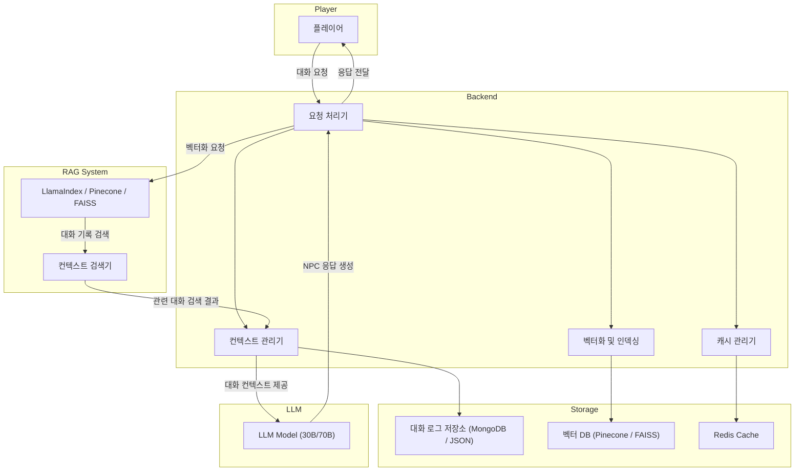

# Llamaindex

<details>

<summary>Llamaindex + docling + faiss [GPT o1]</summary>

아래 예시는 **docling**으로 문서를 파싱/청크(chunk)한 결과물을 **FAISS** 벡터 스토어에 저장하고, 이를 로드하여 검색(Retrieval)을 수행한 뒤 로컬 Hugging Face LLM과 연계(RAG)하는 과정을 순서대로 보여줍니다.\
(구체적인 모델/파일 경로 등은 예시이므로, 필요에 따라 변경해주세요.)

***

## 1. 기본 라이브러리 설치/환경 구성

```bash
pip install docling faiss-cpu sentence-transformers transformers
```

* **`faiss-cpu`**: CPU용 FAISS 패키지 (GPU 환경에서는 `faiss-gpu`를 설치)
* **`sentence-transformers`**: 임베딩 생성을 위한 모델(예: Ko-SentenceBERT 등)
* **`transformers`**: 로컬 LLM 모델 로딩을 위한 라이브러리

**주의**: Windows 환경에서 FAISS 설치가 복잡할 수 있으니, Anaconda 환경에서 `conda install faiss-cpu -c pytorch`와 같이 진행하는 것도 방법입니다.

***

## 2. docling으로 문서 파싱 및 텍스트 청크 추출

```python
from docling import DocumentProcessor, PDFParser

# 1) PDFParser를 사용한 예시
processor = DocumentProcessor(
    parser=PDFParser(),   # PDF -> 텍스트 변환 + 청크
    chunk_size=512,       # 청크 크기
    overlap=50            # 청크 사이 중첩
)

# 2) 실제 PDF 파일 입력
parsed_documents = processor.process("sample.pdf")

print(f"총 청크 개수: {len(parsed_documents)}")
# parsed_documents 는 각 청크의 텍스트(str)를 원소로 하는 리스트 형태
# 예) ["문서 일부 문장 ...", "다음 청크 내용 ...", ...]
```

위 코드를 통해 `sample.pdf`에서 추출된 텍스트가 512 토큰(혹은 문자) 단위로 분할된 결과를 얻을 수 있습니다.\
(docling 내부 설정에 따라 토크나이저/분할 방식이 다를 수 있습니다.)

***

## 3. 파싱된 텍스트를 FAISS에 저장

FAISS는 벡터(Embedding) 인덱스를 관리해주는 라이브러리입니다.

1. 우선 **임베딩 모델**(여기서는 Sentence-BERT 계열)을 사용해 각 청크 텍스트를 벡터로 변환
2. 변환된 벡터를 FAISS 인덱스에 저장

다음 예시는 \*\*`sentence-transformers`\*\*의 Ko-SentenceBERT(예: `jhgan/ko-sroberta-multitask`)를 사용합니다.

```python
import faiss
import numpy as np
from sentence_transformers import SentenceTransformer

# 1) 임베딩 모델 로드 (한국어 기준 예시)
embedding_model = SentenceTransformer("jhgan/ko-sroberta-multitask")

# 2) 파싱된 문서 청크 => 임베딩 생성
#    parsed_documents: ["청크1", "청크2", ...]
embeddings = embedding_model.encode(parsed_documents, show_progress_bar=True)
embeddings = np.array(embeddings, dtype='float32')  # FAISS는 float32를 권장

print("임베딩 벡터 크기:", embeddings.shape)  
# 예) (num_chunks, 768)

# 3) FAISS 인덱스 생성
dimension = embeddings.shape[1]  # 임베딩 차원 (예: 768)
index_flat = faiss.IndexFlatL2(dimension)  # L2 거리 기반 기본 인덱스

# 4) ID를 붙이고 싶다면 IndexIDMap 사용
#    -> 각 청크마다 고유 id(index)
index_id_map = faiss.IndexIDMap(index_flat)
ids = np.arange(len(parsed_documents))  # 0 ~ n-1
index_id_map.add_with_ids(embeddings, ids)

# 5) 인덱스 디스크에 저장
faiss.write_index(index_id_map, "doc_chunks.faiss")

print("FAISS 인덱스 저장 완료!")
```

이렇게 하면,

* `doc_chunks.faiss` 파일에 우리가 파싱한 텍스트 청크들의 임베딩 인덱스가 저장됩니다.
* 실제 질의 시에는 이 인덱스를 다시 로드하여 검색을 수행합니다.

(메타데이터나 원본 텍스트는 FAISS 내부에 직접 저장되는 것이 아니므로, **ID → 원본 텍스트**를 매핑할 별도 구조(예: 파이썬 리스트 또는 DB)가 필요합니다. 여기서는 `parsed_documents` 리스트 자체를 그대로 보관하고 ID로 연결하면 됩니다.)

***

## 4. 검색(질의)에 활용하기: FAISS 인덱스 로드 + 상위 문서 추출

사용자가 질문을 하면, 그 질문을 임베딩하여 FAISS 인덱스에서 **Top-k** 문서를 찾은 뒤, 해당 청크들을 가져옵니다.

```python
import faiss
import numpy as np

# 1) FAISS 인덱스 로드
faiss_index = faiss.read_index("doc_chunks.faiss")

# 2) 검색용 함수 예시
def search_faiss(query: str, top_k: int = 3):
    # 쿼리 임베딩
    q_emb = embedding_model.encode([query], show_progress_bar=False)
    q_emb = np.array(q_emb, dtype='float32')
    
    # FAISS 검색
    distances, indices = faiss_index.search(q_emb, top_k)
    
    # 상위 k개 결과(여기서는 첫 번째 쿼리에 대한 결과)
    top_ids = indices[0]
    top_scores = distances[0]
    
    # ID를 통해 원본 텍스트(청크) 가져오기
    # parsed_documents는 메모리에 있다고 가정
    results = []
    for i, idx in enumerate(top_ids):
        chunk_text = parsed_documents[idx]
        score = top_scores[i]
        results.append((idx, chunk_text, score))
    
    return results

# 3) 실제 질의 예시
user_query = "이 문서에서 제시된 정책의 핵심 내용은 무엇인가?"
search_results = search_faiss(user_query, top_k=3)
for idx, text, dist in search_results:
    print(f"[{idx}] score={dist} => {text[:100]}...")
```

이 과정을 통해,

* 사용자가 입력한 질문(`user_query`)이 임베딩되고
* FAISS 인덱스에서 가장 유사도가 높은(거리로 보면 가장 가까운) 청크 N개를 가져와
* 그 청크 내용(원문 텍스트)을 확인할 수 있습니다.

***

## 5. 로컬 Hugging Face LLM에 문맥(Context)으로 넣어 RAG 방식 답변 생성

FAISS에서 검색한 상위 문서 청크(문맥)를 **프롬프트**에 포함시켜 LLM이 답변을 작성하도록 하면, RAG(검색 증강) 방식의 Q\&A가 가능합니다.

예시로, Hugging Face Transformers의 **text-generation 파이프라인**을 사용한다고 가정:

```python
from transformers import AutoTokenizer, AutoModelForCausalLM, pipeline

# 1) 로컬(혹은 HF 허브) LLM 모델 로드
#    예: KoAlpaca, GPT-Neo, Llama2 등 원하는 모델 선택
MODEL_NAME = "EleutherAI/gpt-neo-1.3B"  # 예시
tokenizer = AutoTokenizer.from_pretrained(MODEL_NAME)
model = AutoModelForCausalLM.from_pretrained(
    MODEL_NAME,
    device_map="auto"  # GPU 사용 가능 시 자동 할당
)

generation_pipeline = pipeline(
    "text-generation",
    model=model,
    tokenizer=tokenizer,
    max_length=1024,
    do_sample=True,
    temperature=0.7
)

def generate_answer_with_context(query: str, context_docs: list):
    """
    context_docs: 검색한 상위 청크 텍스트들의 리스트
    """
    # 문맥 여러 청크를 하나로 합치거나, 길이가 길면 요약/잘라내기 필요
    combined_context = "\n".join(context_docs)

    # 간단한 RAG 프롬프트 예시
    prompt = f"""
아래는 관련 문서 내용입니다:
--------------------------------
{combined_context}
--------------------------------

위 문서를 근거로 다음 질문에 대해 간결하고 정확한 답변을 작성해주세요:
{query}
답변:
"""

    output = generation_pipeline(prompt)
    answer = output[0]["generated_text"]
    return answer


# 실제 질의 예시
user_query = "이 문서에서 제시된 정책의 핵심 내용은 무엇인가?"
search_results = search_faiss(user_query, top_k=3)
context_list = [res[1] for res in search_results]  # [ (id, text, score), ... ]
final_answer = generate_answer_with_context(user_query, context_list)

print("=== RAG 기반 최종 답변 ===")
print(final_answer)
```

이렇게 하면,

1. 사용자가 입력한 질문 → `search_faiss()` 로 FAISS 인덱스에서 유사 청크 상위 3개를 가져옴
2. 가져온 청크 텍스트를 하나의 컨텍스트로 묶음
3. LLM에게 “해당 컨텍스트를 참고하여 질문에 답하라”는 프롬프트 제공
4. LLM이 문맥을 바탕으로 최종 답을 생성

이 과정을 통해 **“내부 문서 기반 RAG 챗봇”** 형태의 질의응답이 구현됩니다.

***

## 6. (선택) llamaindex + FAISS 연동도 가능

`llamaindex`(구 GPT Index)에는 내부적으로 **FAISS** 벡터 스토어를 연동하는 기능이 있으며, `docling` 결과물(문서+청크)을 `Document` 형태로 변환한 뒤 **llamaindex**로 인덱싱할 수도 있습니다.\
예를 들어,

```python
from llama_index import SimpleDirectoryReader, GPTFaissIndex, ServiceContext
from llama_index.embeddings import HuggingFaceEmbedding

# 1) docling으로 파싱한 텍스트 => llamaindex 문서로 변환
#    parsed_documents 는 [str, str, ...] 이므로
from llama_index import Document
documents = [Document(t) for t in parsed_documents]

# 2) HF 임베딩 모델 설정
hf_embed = HuggingFaceEmbedding(model_name="sentence-transformers/all-MiniLM-L6-v2")
service_context = ServiceContext.from_defaults(embed_model=hf_embed)

# 3) llamaindex의 GPTFaissIndex 생성
faiss_index = GPTFaissIndex.from_documents(
    documents,
    service_context=service_context
)
faiss_index.save_to_disk("faiss_llamaindex.json")

# 4) 검색 & 질의
response = faiss_index.query("사용자 질문", similarity_top_k=3)
print(response.response)
```

이처럼 llamaindex가 검색부터 LLM 호출까지 일괄적으로 진행할 수 있으나, **직접 FAISS를 다루는 것보다 추상화**가 높고, 내부적으로는 llamaindex가 “FAISS + 임베딩 모델 + LLM 호출”을 자동으로 연결해줍니다. 어느 방식이든 프로젝트 요구사항(직접 제어 vs. 편의성)에 따라 골라 쓰시면 됩니다.

***

### 요약

1. **문서 파싱 (docling)**
   * PDF, Word, HTML 등 → 텍스트 청크로 변환
2. **텍스트 임베딩**
   * `sentence-transformers` 등 한국어 임베딩 모델로 청크 → 벡터 변환
3. **FAISS 인덱스 구성**
   * 청크 임베딩을 FAISS에 저장 (`IndexIDMap`, `add_with_ids`)
   * 디스크에 `.faiss` 파일로 저장 가능
4. **검색(질의)**
   * 사용자 질문 → 임베딩 → FAISS에서 최근접 청크 상위 K개 검색
   * 청크 ID로 원문 텍스트 조회
5. **LLM RAG**
   * 검색된 청크를 문맥으로 합쳐 로컬 LLM에 프롬프트로 전달
   * LLM이 **기존 문서 내용**을 참고한 답변 생성 → Hallucination(환각) 줄이기

위 단계대로 구성하면, 로컬에서 문서를 RAG에 적용하는 **질의응답/챗봇**을 구현할 수 있습니다.\
시스템 규모(모델 크기, 문서 양, GPU/CPU 여부)에 따라 최적화 전략(양자화 모델, LoRA, chunk 사이즈 조절 등)을 병행하는 것이 좋습니다.

</details>

<details>

<summary>권장 아키텍쳐 구성 방법을 순서대로 하나씩 알려줘. 설치 명령어 같은 것들은 제외하고. 간단히 순서대로.</summary>

#### ✅ **권장 아키텍처 구성 순서**

#### **1. 프로젝트 구조 설계 및 환경 설정**

* 프로젝트 폴더 구조 설계
* 가상환경 생성 및 Python 패키지 관리 (`requirements.txt` or `pyproject.toml`)
* 주요 모듈 정의 (`backend`, `storage`, `rag`, `llm`, `utils` 등)

***

#### **2. 데이터베이스 설계 및 설정**

* 대화 로그 저장소 설계 (MongoDB, Redis 등)
  * 대화 로그 데이터 스키마 설계 (`npc_id`, `timestamp`, `message`, `response` 등)
* 벡터 DB 설계 (FAISS, Pinecone)
  * 벡터 인덱스 생성 (텍스트 벡터화, NPC별 인덱스 분리)

***

#### **3. RAG 시스템 설계 및 구현**

* LlamaIndex 또는 FAISS 인덱스 설계
  * 대화 로그에서 텍스트를 벡터화
  * 벡터 인덱스 생성 및 저장
* 검색 쿼리 구조 설계 (NPC ID, 대화 주제 등 기반)
* 컨텍스트 검색기 구현 (유사 대화 검색 모듈)

***

#### **4. LLM 모델 구성 및 통합**

* LLM 모델 선택 및 설정 (30B 또는 70B)
* LLM 호출 모듈 구현 (`query_model()` 함수 설계)
* 컨텍스트 입력 형식 정의 (`NPC ID`, `대화 주제`, `이전 대화 컨텍스트` 포함)

***

#### **5. 백엔드 서버 구현**

* API 서버 구조 설계 (FastAPI 또는 Flask)
  * `/dialogue` - 플레이어 대화 요청 엔드포인트
  * `/vectorize` - 텍스트 벡터화 엔드포인트
  * `/search` - 컨텍스트 검색 엔드포인트
* 컨텍스트 관리 모듈 (`context_manager.py`)
* 캐싱 모듈 (`cache_manager.py`)

***

#### **6. 데이터 흐름 관리 및 인덱싱**

* 대화 로그가 생성될 때마다 벡터화 및 인덱싱
* 벡터 DB와 대화 로그 저장소 간 데이터 동기화 로직 구현
* 대화 로그 압축 및 주기적 클리닝 스크립트 작성

***

#### **7. 캐싱 및 최적화**

* Redis 또는 메모리 캐시 구현
  * 최근 대화 기록 캐싱 (`NPC ID`, `대화 주제`, `응답`)
* 벡터 DB에서 자주 참조되는 인덱스 캐싱

***

#### **8. 테스트 및 검증**

* 각 모듈별 테스트 코드 작성 (`pytest`, `unittest`)
* 통합 테스트:
  * 플레이어 → 대화 요청 → 백엔드 → RAG → LLM → 응답 생성 → 로그 저장
* 성능 테스트: 대화량 증가 시 벡터 DB 및 LLM 응답 시간 측정

***

#### **9. 배포 및 운영**

* Dockerfile 작성 및 컨테이너화
* 서버 환경 설정 (Gunicorn, Nginx)
* 로그 모니터링 및 오류 처리 (Sentry, ELK Stack 등)

***

#### **10. 유지보수 및 확장**

* 대화 로그 관리 정책 (장기 대화 아카이빙, 요약 저장)
* 벡터 DB의 인덱스 업데이트 주기 설정
* LLM 모델 업그레이드 시 데이터 구조 변경 관리

이제 이 순서 중에서 더 구체적으로 알고 싶은 단계가 있을까요? 또는 특정 모듈의 설계에 대해 더 설명해줄까요?

</details>




